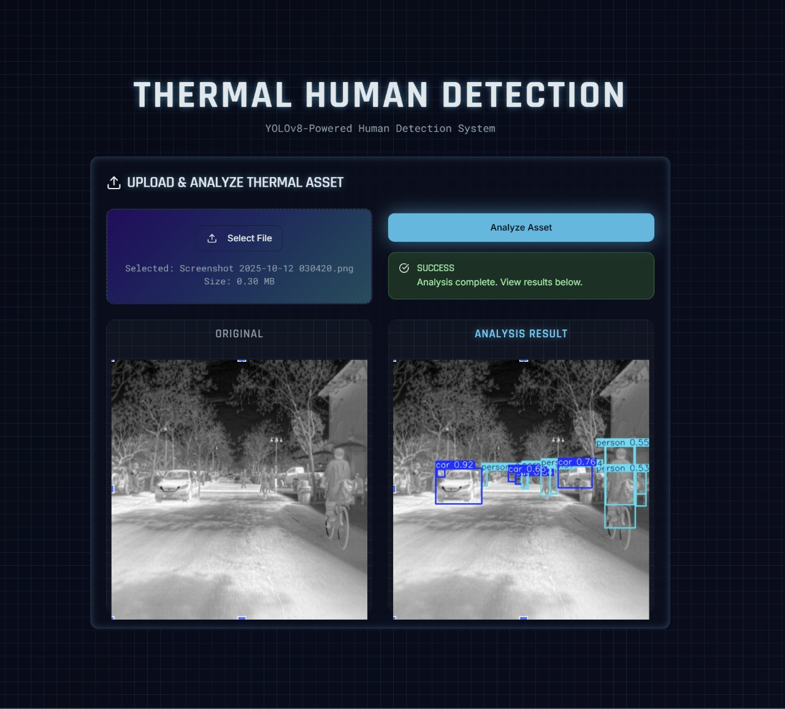

# Thermal Human Detection for Military Surveillance


A real-time, lightweight object detection pipeline using a fine-tuned YOLOv8n model to detect humans and vehicles in thermal imagery, optimized for embedded surveillance platforms.

---
To provide an intuitive and accessible way to test the model's capabilities, we have developed a simple, interactive web-based demo (https://thermal-detection-app.onrender.com/).
Explore the full project ecosystem:
- **Frontend (Web App):** [Thermal Detection WebApp](https://github.com/Manimozhi121/thermal-detection-webapp)
- **Backend (API Server):** [Thermal Detection API](https://github.com/Manimozhi121/thermal-detection-api)

---
Demo Video and PPT: https://drive.google.com/drive/folders/1hAS_P8umApZ7OBaevNWgoztXZ_C1Lj_8?usp=drive_link



## Key Features
- **High Accuracy:** Achieved a **mAP@0.5 of 0.862** on the validation set, surpassing the project's stretch goals.
- **Lightweight & Fast:** The final ONNX model is only **11.6 MB** and has an estimated real-time speed of **~135 FPS** with TensorRT.
- **End-to-End Pipeline:** Includes reproducible scripts for data preparation, training, inference, and model exporting.
- **Edge Ready:** The model is exported to the standard ONNX format, and a TensorRT build script is provided for easy deployment on NVIDIA embedded devices.

---

## Getting Started

### Prerequisites
- Python 3.8+
- Git
- A Roboflow API Key

### Setup
1.  **Clone the repository:**
    ```bash
    git clone https://github.com/Shanmathi-Thamizhinian/thermal-human-detection.git
    cd thermal-human-detection
    ```
2.  **Install dependencies:**
    ```bash
    pip install -r requirements.txt
    ```
3.  **Set up your API Key:**
    Create a `.env` file in the root directory and add your Roboflow key:
    ```
    ROBOFLOW_API_KEY="YOUR_API_KEY_HERE"
    ```

### Usage Workflow
1.  **Prepare the Dataset:**
    *(This only needs to be run once)*
    ```bash
    python data/prepare_data.py
    ```
2.  **Run Inference with the Pre-trained Model:**
    Use the provided `best.pt` model to run predictions on images or folders.
    ```bash
    # On a single image
    python infer_image.py --source path/to/your/image.jpg

    # On a folder of images, creating a video
    python infer_folder.py --source path/to/your/folder --to_video 25
    ```
3.  **(Optional) Re-train the Model:**
    ```bash
    # Make sure to use the correct path from the prepare_data step
    python train.py --data path/to/your/data.yaml --epochs 30
    ```
4.  **(Optional) Export to ONNX:**
    ```bash
    python export_onnx.py
    ```

---

## Repository Structure

The repository is organized to separate code, models, and results.
```
thermal-human-detection/
├── artifacts/
│   ├── images
│   ├── results
│   └── ...
├── data/
│   ├── README.md
│   └── prepare_data.py
├── models/
│   ├── best.pt
│   ├── best.onnx
│   └── config.yaml
├── .env
├── .gitignore
├── BENCHMARK.md
├── build_trt.sh
├── export_onnx.py
├── infer_folder.py
├── infer_image.py
├── README.md
├── REPORT.md
├── requirements.txt
└── train.py
```

